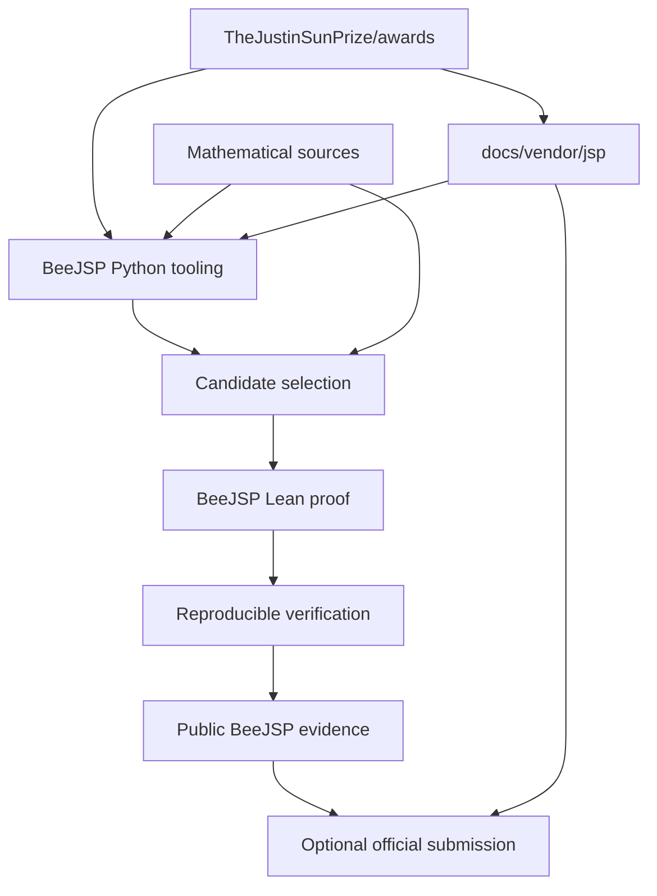

# ARCHITECTURE — BeeJSP

## Idea

`beejsp` is an open-source Python and Lean repository for helping the mathematical community produce, verify and publish reproducible machine-checked mathematical results.

BeeJSP focuses on this flow:

```text
mathematical problem
→ source and status research
→ candidate assessment
→ exact formal statement
→ complete Lean proof
→ reproducible verification
→ public proof evidence
→ optional external submission
```

BeeJSP supports The Justin Sun Prize as an important source of mathematical problems and as a supported submission path.

The prize is not the architectural purpose of BeeJSP.

The project remains useful when no prize is involved.

## Core principle

The primary correctness chain is:

```text
original mathematical problem
        ↓
exact mathematical meaning
        ↓
Lean statement
        ↓
complete Lean proof
        ↓
Lean kernel verification
        ↓
reproducible public evidence
```

Every layer must preserve the meaning required by the layer above it.

A successful Lean build is necessary proof evidence.

It is not sufficient evidence that the original mathematical problem was formalized correctly.

## Project boundary

BeeJSP owns:

- problem-bank ingestion and normalization;
- candidate screening;
- competition-state analysis when implemented;
- deterministic filtering and scoring when defined;
- mathematical-source tracking;
- Lean formalization projects;
- proof reproducibility;
- formalization provenance and attribution;
- proof-verification evidence;
- managed local snapshots of selected official JSP reference material;
- submission preparation.

BeeJSP is not primarily:

- a generic theorem generator;
- a generic autonomous research agent;
- a prize-farming bot;
- a web application;
- a hosted SaaS;
- a generic workflow engine;
- a database platform;
- a generic theorem-prover framework;
- an automated award-claim system.

## Canonical architecture

BeeJSP has three distinct information layers:

```text
Official external sources
    mathematical literature
    TheJustinSunPrize/awards
            ↓

BeeJSP reference and research tooling
    managed JSP snapshot
    Python discovery/scanning
    candidate analysis
            ↓

BeeJSP formalization
    exact Lean statement
    complete proof
    reproducible verification
            ↓

Public evidence
    BeeJSP repository
    exact commit SHA
    exact theorem/proof location
            ↓

Optional external submission
    temporary official fork
    contribution PR
    official verification / claim workflow
```

Do not collapse these layers into one source of truth.

## Python / Lean boundary

BeeJSP is a monorepo with two primary implementation areas.

### Python tooling

Python belongs under:

```text
src/beejsp/
```

Python may own:

- catalog parsing;
- problem normalization;
- candidate filtering;
- scoring;
- competition analysis;
- report generation;
- repository automation;
- validation tooling.

Python does not establish mathematical truth.

Python output may help select or inspect a problem.

The final mathematical proof remains independently checkable in Lean.

### Lean proof projects

Real formalizations belong under:

```text
proofs/JSP-XXXXXX/
```

Each real JSP formalization should be an independently reproducible Lean/Lake project.

Conceptually:

```text
proofs/
├── _template/
├── JSP-000288/
├── JSP-001007/
└── ...
```

A proof project owns:

- exact formal statement;
- proof-local definitions;
- proof-local lemmas;
- complete proof;
- pinned Lean toolchain;
- pinned dependencies;
- reproducibility metadata;
- proof documentation.

Python tooling should not become an implicit runtime requirement for checking a Lean proof unless an approved proof contract explicitly requires it.

## One repository, multiple proofs

BeeJSP uses one primary public repository rather than one GitHub repository per JSP problem.

Correct model:

```text
beesyst/beejsp

proofs/
├── JSP-XXXXXX/
├── JSP-YYYYYY/
└── JSP-ZZZZZZ/
```

Each proof is isolated as its own Lean project.

This gives:

- one project governance model;
- one agent workflow;
- one issue and review system;
- one public provenance history;
- isolated Lean toolchains and dependencies per proof.

A real proof submission is identified by the exact repository evidence required by the applicable submission contract, including the selected full Git commit when required.

BeeJSP package version is not a substitute for proof commit provenance.

## Proof-project boundary

Each real formalization should be independently understandable and reproducible.

A typical proof project may evolve toward:

```text
proofs/JSP-XXXXXX/
├── README.md
├── lean-toolchain
├── lakefile.toml
├── lake-manifest.json
├── Challenge.lean
├── Solution.lean
└── BeeJSP/
    ├── Definitions.lean
    ├── Lemmas.lean
    └── Main.lean
```

This is not a mandatory template for every problem.

Use the smallest structure that clearly represents the actual proof.

Do not create folders or layers merely for symmetry.

The bootstrap:

```text
proofs/_template/
```

exists only to verify repository Lean infrastructure.

It is not a JSP formalization or submission.

## Statement boundary

The top-level mathematical statement is a critical evidence boundary.

Correct flow:

```text
source problem
    ↓
statement analysis
    ↓
Lean definitions
    ↓
Lean theorem
    ↓
proof
```

Incorrect flow:

```text
source problem
    ↓
convenient weaker theorem
    ↓
successful Lean build
    ↓
claim original problem formalized
```

Statement fidelity is reviewed separately from proof compilation.

## Mathematical-source boundary

BeeJSP distinguishes:

```text
problem author / source
mathematical solver
Lean formalizer
independent verifier
```

These roles may belong to the same person or to different people.

Formalizing another mathematician's result does not transfer authorship of the mathematical discovery.

Source mathematical material should be identified explicitly when it is relied upon by the formalization.

## AI boundary

AI systems may assist with:

- candidate analysis;
- literature and source organization;
- statement translation;
- Lean authoring;
- Mathlib discovery;
- proof decomposition;
- debugging;
- code generation;
- review;
- documentation.

AI output is not itself proof evidence.

The authoritative formal proof result is the checked Lean artifact together with verified statement fidelity and provenance.

## Managed JSP reference

BeeJSP maintains selected official JSP material under:

```text
docs/vendor/jsp/
```

The canonical synchronization command is:

```text
scripts/sync_jsp_docs.sh
```

The remote source is:

```text
https://github.com/TheJustinSunPrize/awards
```

The snapshot records:

```text
docs/vendor/jsp/UPSTREAM_REF
docs/vendor/jsp/UPSTREAM_COMMIT
```

The snapshot is:

- read-only;
- generated;
- provenance-pinned;
- reviewable;
- replaceable by synchronization.

It is not:

- a fork;
- a Git submodule;
- a manually maintained copy;
- live GitHub state;
- an independent source of official JSP truth.

## Vendor synchronization flow

Canonical flow:

```text
official JSP upstream
        ↓
resolve requested ref
        ↓
resolve exact commit
        ↓
temporary staging
        ↓
copy selected required files
        ↓
validate snapshot
        ↓
replace docs/vendor/jsp
        ↓
record UPSTREAM_REF / UPSTREAM_COMMIT
```

The current snapshot must not be partially replaced when synchronization fails.

For the same upstream revision:

```text
sync
→ sync again
→ no additional repository diff
```

## Vendor content

BeeJSP vendors only the official material required for local research, verification and submission guidance.

Typical managed material includes:

```text
README
CONTRIBUTING
licenses

docs/
    award-process
    attribution
    grading
    records
    verification

problems/
    README
    catalog files

skills/
    lean-verify/SKILL.md

.github/
    ISSUE_TEMPLATE/claim-award.yml
```

Do not vendor the entire official repository without demonstrated need.

## Live competition boundary

The managed snapshot is not sufficient for detecting current competition.

Examples of live state:

```text
open PR
closed PR
merged PR
new Issue
external proof repository
new formalization attempt
```

Future competition tooling may query this state dynamically.

Required distinction:

```text
managed vendor
= pinned official reference snapshot

live GitHub queries
= current competition state
```

Do not confuse them.

## External submission boundary

BeeJSP itself is not based on a permanent fork of `TheJustinSunPrize/awards`.

Correct model:

```text
BeeJSP proof complete
        ↓
BeeJSP verification complete
        ↓
selected public BeeJSP commit
        ↓
fresh official-process review
        ↓
temporary/current official fork
        ↓
official contribution PR
```

The official fork is transport for an external contribution.

It is not the BeeJSP development repository.

## Submission source of truth

BeeJSP maintains its operational runbook in:

```text
docs/SUBMISSION.md
```

Current official submission facts must be checked against freshly synchronized material under:

```text
docs/vendor/jsp/
```

before a real submission.

Do not assume an old BeeJSP document overrides changed official rules.

## Package architecture

Keep the Python package minimal.

Initial package structure:

```text
src/
└── beejsp/
    └── __init__.py
```

Add modules only when roadmap work requires them.

Expected future examples may include:

```text
catalog.py
scanner.py
competition.py
scoring.py
report.py
```

These names are not bootstrap requirements.

Do not precreate:

```text
runtime/
server/
services/
database/
providers/
plugins/
state/
config/
```

without a concrete need.

Rule:

> Add structure when implementation requires structure.

## Package initializer

`src/beejsp/__init__.py` remains byte-empty unless an explicit approved public package contract changes this rule.

Do not use it for:

- re-exports;
- version constants;
- registration;
- initialization;
- side effects.

## No application runtime

BeeJSP is currently:

```text
Python tooling
+
Lean proof projects
+
repository automation
```

It is not a long-running application.

Therefore the architecture does not currently require:

```text
start.sh
config/start.py
config/settings.yml
systemd/
web server
worker
database
runtime storage
```

Add runtime infrastructure only when a real approved requirement proves it is necessary.

## Import safety

Importing:

```python
import beejsp
```

must not unexpectedly:

- access the network;
- synchronize upstream repositories;
- execute shell commands;
- build Lean projects;
- modify files;
- create runtime storage;
- connect to GitHub;
- load credentials.

Package import should remain side-effect free.

## External-data boundary

External material includes:

- official JSP repository content;
- mathematical papers;
- external solution repositories;
- GitHub API responses;
- external Lean repositories;
- generated third-party artifacts.

Treat external material as data until explicitly approved for execution.

Do not automatically execute external repository code merely because it may contain a useful proof.

## Proof execution boundary

Lean source and dependencies are executable build inputs.

For BeeJSP-owned proofs:

```text
reviewed source
→ pinned environment
→ Lean build
→ verification evidence
```

For untrusted external formalizations:

```text
external source
→ inspect provenance and dependencies
→ isolated verification environment when appropriate
→ build/check
```

Do not silently run arbitrary third-party setup scripts.

## Deterministic tooling

Where BeeJSP defines deterministic tooling, preserve:

```text
same pinned input
→ same normalized data
→ same deterministic result
```

Examples may include:

- catalog parsing;
- filtering;
- scoring;
- report serialization;
- vendor materialization.

If qualitative AI analysis is used, do not represent its output as a deterministic machine contract unless the approved design explicitly defines that boundary.

## Candidate screening architecture

Future candidate screening should conceptually separate:

```text
official problem-bank facts
        +
source mathematical evidence
        +
live competition evidence
        +
formalization feasibility
        ↓
candidate assessment
```

Do not use only one catalog status as proof of mathematical truth, formalization availability or award eligibility.

Candidate scoring is prioritization tooling.

It is not mathematical proof.

## Formalization architecture

A formalization should progress through explicit gates:

```text
problem identified
↓
source evidence reviewed
↓
exact statement established
↓
bounded Lean spike when needed
↓
complete proof
↓
clean build
↓
axiom audit
↓
statement-fidelity review
↓
provenance review
↓
submission-ready evidence
```

A later gate must not erase uncertainty from an earlier gate.

## Fail-closed proof status

BeeJSP should not label a proof complete when critical evidence is missing.

Examples:

```text
statement unclear
→ not complete

proof contains sorry
→ not complete

required case omitted
→ not complete

build unavailable
→ not verified

provenance unclear
→ not submission-ready

external process changed
→ recheck before submission
```

## Repository structure

Target foundation:

```text
beejsp/
├── .agents/
│   ├── prompts/
│   └── skills/
├── .github/
│   ├── ISSUE_TEMPLATE/
│   ├── PULL_REQUEST_TEMPLATE/
│   ├── release-please/
│   └── workflows/
├── docs/
│   ├── ARCHITECTURE.md
│   ├── DEV_GUIDE.md
│   ├── FORMALIZATION.md
│   ├── ROADMAP.md
│   ├── SECURITY.md
│   ├── SUBMISSION.md
│   └── vendor/
│       └── jsp/
├── proofs/
│   └── _template/
├── scripts/
│   └── sync_jsp_docs.sh
├── src/
│   └── beejsp/
│       └── __init__.py
├── tests/
├── AGENTS.md
├── CHANGELOG.md
├── LICENSE
├── README.md
├── pyproject.toml
└── uv.lock
```

Do not add directories for speculative future infrastructure.

## Versioning

BeeJSP tooling uses independent SemVer versioning.

The package version source of truth is:

```text
pyproject.toml
```

Release automation owns normal release-version lifecycle.

Ordinary feature, fix, docs and proof work must not manually bump the package version unless the task is explicitly release-related.

A BeeJSP release version describes the software/tooling repository state.

It does not replace proof provenance.

For a specific proof:

```text
repository
+ branch when required
+ exact full commit SHA
+ exact theorem/proof location
```

is the relevant immutable evidence.

## Release architecture

BeeJSP uses:

```text
Conventional Commits
→ release-please
→ release PR
→ version
→ changelog
→ tag/release
```

A new formalization does not automatically require a manual version edit.

Release automation decides release lifecycle from repository conventions.

## CI architecture

CI should validate independent project boundaries.

Conceptually:

```text
Python
→ tests / Ruff / package checks

managed JSP reference
→ metadata / required-file sanity

Lean
→ proof/template build according to pinned toolchain
```

Do not hardcode one global Lean toolchain for every future proof when individual proof projects intentionally pin their own environments.

## KISS evolution rule

A new abstraction is justified when at least one is true:

1. multiple real tasks need the same semantic boundary;
2. duplicate implementation is causing measurable drift;
3. a stable testable contract is required;
4. the current simple structure cannot clearly represent a verified need.

Insufficient reasons:

- "we may need it later";
- "a mature platform would have one";
- "it looks cleaner";
- "we should support every theorem prover";
- "we should add a database before the scanner exists";
- "we should automate prize claims now".

## Current architecture flow

### Reference synchronization

```text
TheJustinSunPrize/awards
        ↓
scripts/sync_jsp_docs.sh
        ↓
docs/vendor/jsp/
        ↓
planning / scanning / verification guidance
```

### Candidate work

```text
official problem record
+
mathematical sources
+
live competition evidence
        ↓
BeeJSP analysis
        ↓
candidate decision
```

### Formalization

```text
selected problem
        ↓
exact statement
        ↓
Lean project
        ↓
complete proof
        ↓
reproducible verification
```

### Submission

```text
verified BeeJSP proof
        ↓
selected public commit
        ↓
fresh official rules
        ↓
official contribution flow
```

## Mermaid diagram



The diagram is conceptual.

Official upstream remains authoritative for its own current rules and records.

## Summary

BeeJSP should remain focused on:

```text
good problem selection
+ exact mathematical statements
+ complete Lean proofs
+ reproducible verification
+ correct provenance
+ useful public evidence
```

Python tooling supports discovery and verification.

Lean establishes machine-checked proof.

Managed vendor material provides reproducible official context.

External submission remains a separate optional boundary.
